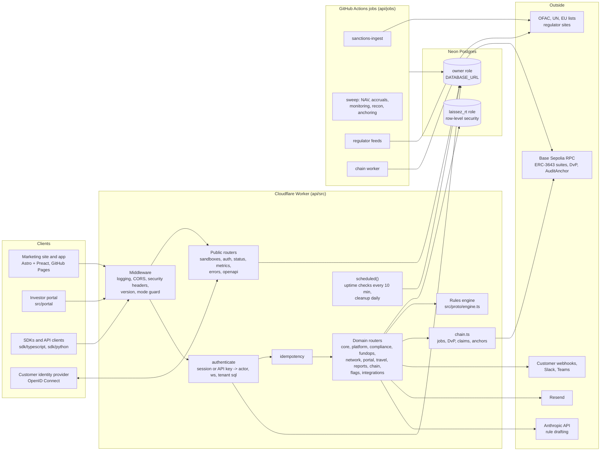

# Architecture

How a request moves through Laissez, how tenants are kept apart, where the rules engine runs, what runs on a schedule, and how settlement reaches the chain. File paths are the source of truth; this page is the map. The data model is in `docs/erd.md`, error codes in `docs/errors.md`, operations in `docs/runbook.md`.

## Components

## Request flow

Every request enters `api/src/index.ts` and passes, in order:

1. `requestLogging` (`logging.ts`): assigns `X-Request-Id`, times the request, writes one JSON log line and samples 1 in 20 requests into `request_log_samples` for the status page.
2. CORS, `securityHeaders` (`routes/platform.ts`) and `versionMiddleware` (`version.ts`, the `Laissez-Version` header).
3. `modeGuard` (`mode.ts`): in production mode every fictional route answers 404 or 403 here, before anything reads the database.
4. Public routers mounted on `/v1` (`auth.ts` `pub`, `platform.publicRoutes`, `core.publicRoutes`, `errors.publicRoutes`, and the public exports of the domain routers), the demo identity provider on `/idp`, Travel Rule on `/trp`, SCIM on `/scim/v2`.
5. The authenticated `/v1` router: `authenticate` (`auth.ts`) resolves a `lz_sess_` session or `lz_test_` API key into an actor, an organization id (`ws`), a rate-limit status and a monthly quota, and sets `c.get('sql')` to a tenant connection. `rateLimitHeaders` writes the limit headers. `idempotency` replays stored responses for repeated `Idempotency-Key` writes. Then the domain routers.

Inside a handler the contract is the same everywhere: `need(c, perm)` checks the permission against the role or key scopes (`http.ts`), the body is parsed with a zod schema (`body(c, schema)`), work happens through `c.get('sql')`, every write appends to the hash-chained `audit_events` through `audit()` or `auditQ()` inside the same transaction, and events fan out after the response (`bg(c, ...)` with `emit()` for webhooks, `notify()` for in-app notifications and their Slack, Teams and JSON channels).

Errors are `throw new ApiError(status, code, message, detail?)`. `app.onError` shapes them as `{ error: { code, message, detail } }`; zod failures become `invalid_request` with the field list. The catalogue is generated from the source (`npm run docs:errors`) and served at `GET /v1/errors`.

## Tenant model

An organization is a row in `workspaces` with `kind` `org`, `sandbox` or `network` (the fictional distributor on the credential network). Every tenant table carries `workspace_id`. Two database roles enforce the separation (`db.ts`):

- The owner connection (`DATABASE_URL`, `adminSql`) bypasses row-level security. It is used for authentication lookups, sandbox creation, cross-organization reads such as credential shares, the status page and the jobs.
- The tenant connection (`DATABASE_URL_TENANT`, `tenantSql`) connects as `laissez_rt`, which has no `BYPASSRLS`. Every query runs in a transaction that first calls `set_config('app.ws', <ws>, true)`; the `tenant` policy on each table (`migrate-003-rls.sql` and the same shape in later migrations) limits reads and writes to `workspace_id = app_ws()`. A handler cannot read another organization's rows even with a bug in its SQL.

People belong to organizations through `memberships` with a role (`admin`, `ops`, `compliance`, `issuer`, `developer`, `auditor`). Roles map to permissions in `http.ts`; API keys carry scopes that map to the same permissions, and two permissions (`policy:approve`, `members:admin`) are human-only. Sandboxes add fictional teammates and the "acting as" switch so one person can try two-person approval; production mode disables both.

Feature flags (`flags.ts`) layer per-organization overrides over global defaults with a 60 second cache. `chain_settlement` gates on-chain settlement; `portal_transfers` is exposed for the investor portal.

## The rules engine

`src/proto/engine.ts` is a deterministic, synchronous `evaluate(order, whatIfs, ctx)` that returns a decision: the outcome (`ALLOW`, `DENY`, `FREEZE`), every check by layer (credential, fund policy, residence law, booking-center licence, documents, fund terms, transfer controls, counterparty, global screens), the binding rules with citations, remedies and the rule-pack versions it applied. The same module runs in the browser for the demo and in the Worker.

In the Worker, `ctx.ts` builds the context from the database (`buildCtx`: investors, credentials, funds, distribution rules, holdings, documents, calendars, sanctions state) and `routes/core.ts` `createDecision` runs the engine, hashes every input it read (`inputs_sha256`), stores the snapshot for point-in-time replay (`POST /v1/decisions/{id}/replay`, `POST /v1/evaluate/as-of`), signs a receipt with the Ed25519 key (`util.ts` `signReceipt`) and emits `decision.created`. Settlement re-runs the engine against current data before anything moves; a settlement without a passing re-check is the public guardrail metric.

Rule packs (`src/proto/rulepacks.ts`, mirrored in the `rule_packs` table) version the thresholds per jurisdiction. Thresholds and citations are real and listed in `src/data/sources.ts`; institutions and people are fictional.

## Jobs

Work that does not fit a Worker request runs in two places:

- Worker cron (`index.ts` `scheduled`): every 10 minutes `uptimeChecks` probes the API, database, chain RPC, sanctions freshness and monitoring recency into `uptime_checks` and processes up to 5 queued chain jobs; daily at 06:17 UTC `dailyCleanup` deletes expired sandboxes and stale rate-limit, challenge, idempotency, session, uptime and log-sample rows, then sends work-queue digests.
- GitHub Actions (`.github/workflows/jobs.yml`, Node scripts in `api/jobs`): sanctions list ingest followed by monitoring in every organization (05:20 UTC), the nightly sweep of NAV and accruals, holder monitoring, reconciliation and audit anchoring (06:40 UTC), regulator feeds every 6 hours, and the chain worker for jobs the Worker's budget cannot finish.

Monitoring (`monitor.ts` `runMonitor`) re-evaluates every holder's standing, writes `monitor_runs` and `monitor_run_items`, opens and closes `work_items`, and notifies the people whose role should act.

## Chain

`chain.ts` runs in the Worker and in the Node chain job. Fund units are ERC-3643 tokens on Base Sepolia; Laissez is the trusted claim issuer every fund's identity registry relies on (claim topic 10101). The deployment record lives in `chain_config` and is cached for a minute.

- An allowed decision that settles on-chain queues a `settle` job (`chain_jobs`) and starts it in the background within the request's subrequest budget. The job onboards custodial investor wallets where needed (identity, claim, registry entry and opening balances in one `LaissezOnboarder` transaction), then sends the atomic delivery-versus-payment transaction through `LaissezDvP`, and marks the settlement settled in the same database transaction that updates holdings.
- Credential revocation and issuance revoke or publish the on-chain claim; policy publication syncs the country allow module.
- Reconciliation (`runRecon`) compares token balances with the register and records `recon_breaks`; the audit anchor job writes each organization's chain head into a Merkle tree and anchors the root on `AuditAnchor`, so `GET /v1/audit-events/verify` can compare the log with the chain.
- Nonces come from Postgres (`chain_nonces`), every transaction has an explicit gas limit, reads are batched through Multicall3, and jobs retry up to 8 times with the failure recorded on the job. `chainEnabled` requires the operator key, the `chain_settlement` flag and a recorded deployment; without all three settlement is simulated and labelled as such.

## Deployment modes

`LAISSEZ_MODE` (`mode.ts`) separates the public sandbox from production. Sandbox mode serves `POST /v1/sandboxes`, the demo identity provider, fictional seed data, test cash and the teammate switch. Production mode answers 404 or 403 to all of them before authentication, never creates sandbox workspaces, never seeds fictional data, and treats test cash auto-mint as off. `npm run test:mode` proves it without a database.
