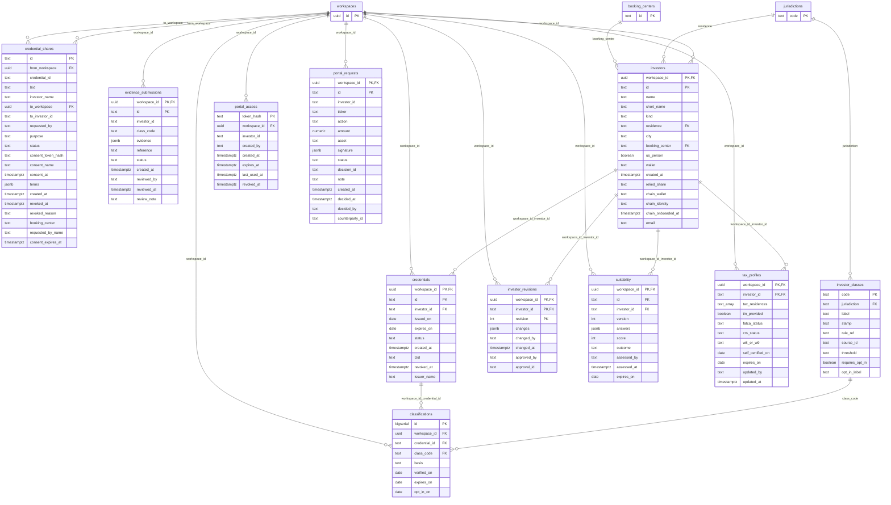
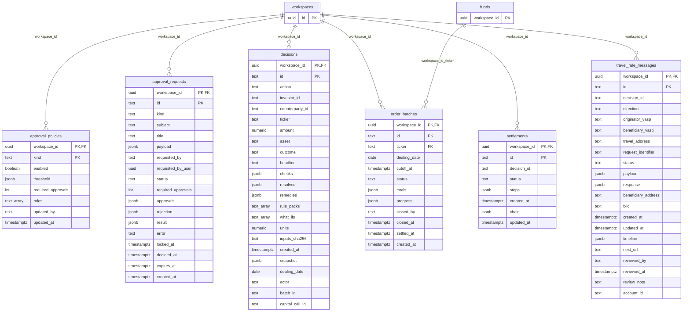
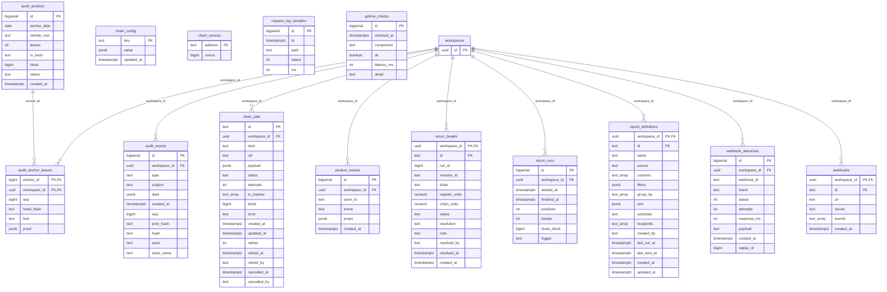

# Data model

Generated from `api/db/schema.sql` and the migrations by `npm run docs:erd`. 79 tables in 6 domains. Every tenant table carries `workspace_id` and a row-level security policy (`migrate-003-rls.sql`); admin-only tables have no grant to `laissez_rt`.

Column types are Postgres types with lengths and checks removed. PK marks primary key columns, FK columns that reference another table. Cross-domain references are drawn with the referenced table repeated in the diagram.

## Domains

- Tenancy and access: `api_keys`, `auth_challenges`, `email_outbox`, `feature_flags`, `idempotency_keys`, `invites`, `leads`, `memberships`, `org_deletions`, `passkeys`, `quotas`, `rate_limits`, `recovery_codes`, `sessions`, `users`, `waitlist`, `workspace_flags`, `workspaces`
- Clients and credentials: `classifications`, `credential_shares`, `credentials`, `evidence_submissions`, `investor_classes`, `investor_revisions`, `investors`, `portal_access`, `portal_requests`, `suitability`, `tax_profiles`
- Funds and policy: `accruals`, `call_notices`, `capital_calls`, `commitments`, `distributions`, `doc_acknowledgments`, `fund_distribution`, `fund_documents`, `fund_policy_versions`, `funds`, `holdings`, `nav_history`, `policy_changes`, `redemption_notices`
- Decisions and settlement: `approval_policies`, `approval_requests`, `decisions`, `order_batches`, `settlements`, `travel_rule_messages`
- Compliance operations: `booking_centers`, `hit_notes`, `holder_status`, `jurisdictions`, `monitor_run_items`, `monitor_runs`, `notification_channels`, `notifications`, `reg_publications`, `rule_drafts`, `rule_packs`, `sanctions_entries`, `sanctions_sources`, `screening_hits`, `screening_list`, `work_items`
- Audit and platform: `audit_anchor_leaves`, `audit_anchors`, `audit_events`, `chain_config`, `chain_jobs`, `chain_nonces`, `product_events`, `recon_breaks`, `recon_runs`, `report_definitions`, `request_log_samples`, `uptime_checks`, `webhook_deliveries`, `webhooks`

## Tenancy and access

Organizations, people, sessions, keys and provisioning.

```mermaid
erDiagram
  api_keys {
    uuid id PK
    uuid workspace_id FK
    text prefix
    text key_hash
    timestamptz created_at
    timestamptz last_used_at
    text name
    text_array scopes
    text_array ip_allowlist
    timestamptz expires_at
    uuid created_by FK
    uuid rotated_from
    text last_used_ip_hash
    text last_used_country
    text last_used_ua
    text_array known_ip_hashes
  }
  auth_challenges {
    uuid id PK
    text challenge
    text purpose
    jsonb data
    timestamptz expires_at
  }
  email_outbox {
    uuid id PK
    uuid workspace_id FK
    text to_email
    text subject
    text html
    text text
    text kind
    text status
    text provider_id
    text error
    text link
    timestamptz created_at
  }
  feature_flags {
    text key PK
    text description
    boolean default_on
    timestamptz created_at
  }
  idempotency_keys {
    uuid workspace_id PK,FK
    text key PK
    text method
    text path
    text request_hash
    int status
    jsonb response
    timestamptz created_at
  }
  invites {
    uuid id PK
    uuid workspace_id FK
    text email
    text role
    text token_hash
    uuid created_by FK
    timestamptz created_at
    timestamptz expires_at
    timestamptz accepted_at
    uuid accepted_by FK
  }
  leads {
    text id PK
    text name
    text email
    text organization
    text role
    text distributes
    text message
    text source
    text ip_hash
    text user_agent
    text status
    uuid notified_email_id
    timestamptz created_at
  }
  memberships {
    uuid workspace_id PK,FK
    uuid user_id PK,FK
    text role
    timestamptz created_at
    text scim_external_id
    text provisioned_by
  }
  org_deletions {
    uuid id PK
    uuid workspace_id
    text name
    text kind
    uuid deleted_by
    text deleted_by_name
    timestamptz deleted_at
    text export_sha256
    jsonb counts
  }
  passkeys {
    text id PK
    uuid user_id FK
    text public_key
    int alg
    bigint sign_count
    text_array transports
    text name
    timestamptz created_at
    timestamptz last_used_at
  }
  quotas {
    uuid workspace_id PK,FK
    date month PK
    bigint count
    timestamptz updated_at
  }
  rate_limits {
    text key PK
    timestamptz window_start
    int count
  }
  recovery_codes {
    uuid id PK
    uuid user_id FK
    text code_hash
    timestamptz created_at
    timestamptz used_at
  }
  sessions {
    uuid id PK
    text token_hash
    uuid user_id FK
    uuid workspace_id FK
    uuid acting_as FK
    text method
    timestamptz created_at
    timestamptz last_seen_at
    timestamptz expires_at
    timestamptz revoked_at
    text ip_hash
    text user_agent
    text country
    text city
    text browser
    text os
  }
  users {
    uuid id PK
    text email
    text name
    text title
    boolean fictional
    uuid sandbox_workspace FK
    timestamptz created_at
    timestamptz last_login_at
  }
  waitlist {
    uuid workspace_id PK,FK
    text id PK
    text ticker FK
    text investor_id FK
    numeric amount
    text asset
    text status
    text reason
    text released_decision_id
    timestamptz released_at
    text created_by
    timestamptz created_at
  }
  workspace_flags {
    uuid workspace_id PK,FK
    text key PK,FK
    boolean enabled
    timestamptz updated_at
  }
  workspaces {
    uuid id PK
    text name
    timestamptz created_at
    timestamptz expires_at
    text kind
    text slug
    text brand_name
    text brand_color
    jsonb sso
    uuid created_by
    text scim_token_hash
    timestamptz scim_token_created_at
    int monthly_quota
    text logo_data_url
    text portal_domain
    text email_footer
    text support_email
    text support_phone
  }
  investors {
    uuid workspace_id PK
  }
  funds {
    uuid workspace_id PK
  }
  workspaces ||--o{ api_keys : workspace_id
  users ||--o{ api_keys : created_by
  workspaces ||--o{ email_outbox : workspace_id
  workspaces ||--o{ idempotency_keys : workspace_id
  workspaces ||--o{ invites : workspace_id
  users ||--o{ invites : created_by
  users ||--o{ invites : accepted_by
  workspaces ||--o{ memberships : workspace_id
  users ||--o{ memberships : user_id
  workspaces ||--o{ org_deletions : workspace_id
  users ||--o{ passkeys : user_id
  workspaces ||--o{ quotas : workspace_id
  users ||--o{ recovery_codes : user_id
  users ||--o{ sessions : user_id
  workspaces ||--o{ sessions : workspace_id
  users ||--o{ sessions : acting_as
  workspaces ||--o{ users : sandbox_workspace
  workspaces ||--o{ waitlist : workspace_id
  investors ||--o{ waitlist : workspace_id_investor_id
  funds ||--o{ waitlist : workspace_id_ticker
  workspaces ||--o{ workspace_flags : workspace_id
  feature_flags ||--o{ workspace_flags : key
```

| Table | Defined in | Columns |
| --- | --- | --- |
| `api_keys` | `api/db/schema.sql` | 16 |
| `auth_challenges` | `api/db/migrate-002.sql` | 5 |
| `email_outbox` | `api/db/migrate-008-accounts.sql` | 12 |
| `feature_flags` | `api/db/migrate-014-platform2.sql` | 4 |
| `idempotency_keys` | `api/db/migrate-002.sql` | 8 |
| `invites` | `api/db/migrate-002.sql` | 10 |
| `leads` | `api/db/migrate-012-leads.sql` | 13 |
| `memberships` | `api/db/migrate-002.sql` | 6 |
| `org_deletions` | `api/db/migrate-008-accounts.sql` | 9 |
| `passkeys` | `api/db/migrate-002.sql` | 9 |
| `quotas` | `api/db/migrate-008-accounts.sql` | 4 |
| `rate_limits` | `api/db/migrate-001-base.sql` | 3 |
| `recovery_codes` | `api/db/migrate-008-accounts.sql` | 5 |
| `sessions` | `api/db/migrate-002.sql` | 16 |
| `users` | `api/db/migrate-002.sql` | 8 |
| `waitlist` | `api/db/migrate-013-workflow.sql` | 12 |
| `workspace_flags` | `api/db/migrate-014-platform2.sql` | 4 |
| `workspaces` | `api/db/schema.sql` | 18 |

## Clients and credentials

Investors, their eligibility credentials and the network of shared credentials.

| Table | Defined in | Columns |
| --- | --- | --- |
| `classifications` | `api/db/schema.sql` | 8 |
| `credential_shares` | `api/db/migrate-002.sql` | 20 |
| `credentials` | `api/db/schema.sql` | 10 |
| `evidence_submissions` | `api/db/migrate-002.sql` | 11 |
| `investor_classes` | `api/db/schema.sql` | 9 |
| `investor_revisions` | `api/db/migrate-013-workflow.sql` | 8 |
| `investors` | `api/db/schema.sql` | 16 |
| `portal_access` | `api/db/migrate-002.sql` | 8 |
| `portal_requests` | `api/db/migrate-002.sql` | 15 |
| `suitability` | `api/db/migrate-013-workflow.sql` | 10 |
| `tax_profiles` | `api/db/migrate-013-workflow.sql` | 11 |

## Funds and policy

Funds, distribution rules, policy changes, documents and fund operations.

```mermaid
erDiagram
  accruals {
    uuid workspace_id PK,FK
    text ticker PK,FK
    date accrual_date PK
    text investor_id PK
    numeric units
    numeric rate_bps
    numeric amount
    text distribution_id
  }
  call_notices {
    uuid workspace_id PK,FK
    text id PK
    text capital_call_id
    text investor_id
    text ticker
    numeric amount
    date due_on
    text status
    text decision_id
    text settlement_id
    text error
    timestamptz sent_at
    timestamptz settled_at
    timestamptz created_at
  }
  capital_calls {
    uuid workspace_id PK,FK
    text id PK
    text ticker
    int call_number
    numeric pct
    date due_on
    text status
    numeric total_called
    timestamptz notice_sent_at
    text issued_by
    timestamptz settled_at
    timestamptz created_at
  }
  commitments {
    uuid workspace_id PK,FK
    text investor_id PK
    text ticker PK
    numeric committed
    numeric called
    numeric distributed
    date committed_on
    timestamptz created_at
    timestamptz updated_at
  }
  distributions {
    uuid workspace_id PK,FK
    text id PK
    text ticker
    date period_start
    date period_end
    date paid_on
    numeric total_amount
    numeric reinvested_units
    int holders
    timestamptz created_at
    text kind
  }
  doc_acknowledgments {
    uuid workspace_id PK,FK
    text investor_id PK,FK
    text document_id PK
    text sha256
    text method
    text signed_name
    text signature
    timestamptz acknowledged_at
  }
  fund_distribution {
    uuid workspace_id PK,FK
    text ticker PK,FK
    text jurisdiction PK,FK
    text_array accepts
    text basis
    text law_requires FK
    text law_text
    text law_ref
    text law_source
    text_array law_requires_any
  }
  fund_documents {
    uuid workspace_id PK,FK
    text id PK
    text ticker FK
    text doc_type
    text title
    int version
    text jurisdiction
    text audience
    text content
    text sha256
    boolean required
    timestamptz published_at
    text published_by
    timestamptz superseded_at
  }
  fund_policy_versions {
    uuid workspace_id PK,FK
    text ticker PK,FK
    int version PK
    timestamptz effective_at
    jsonb distribution
    numeric min_subscription
    int holder_cap
    int lockup_months
    text published_by
  }
  funds {
    uuid workspace_id PK,FK
    text ticker PK
    text name
    text short_name
    text domicile
    text structure
    text currency
    numeric nav
    boolean reg_s
    text_array us_accepts
    numeric min_subscription
    int holder_cap
    int holders
    int lockup_months
    text_array assets
    text_array chains
    text issuer
    int policy_version
    text share_class_type
    text cutoff_time
    text cutoff_tz
    text dealing_frequency
    int notice_days
    numeric gate_pct
    numeric yield_bps
    text chain_token
    text treasury_wallet
    int reg_s_category
    date offering_date
    numeric max_holder_pct
    numeric max_holding_per_investor
    text fund_type
  }
  holdings {
    uuid workspace_id PK,FK
    text investor_id PK,FK
    text ticker PK,FK
    numeric units
    date since
  }
  nav_history {
    uuid workspace_id PK,FK
    text ticker PK,FK
    date nav_date PK
    numeric nav
    numeric daily_yield_bps
    text struck_by
    timestamptz struck_at
  }
  policy_changes {
    uuid workspace_id PK,FK
    text id PK
    text ticker
    text proposed_by
    text status
    jsonb changes
    jsonb impact
    text approved_by
    timestamptz decided_at
    timestamptz created_at
    uuid proposed_by_user
    uuid approved_by_user
  }
  redemption_notices {
    uuid workspace_id PK,FK
    text id PK
    text investor_id
    text ticker
    numeric units
    date notice_date
    date dealing_date
    text status
    timestamptz created_at
  }
  workspaces {
    uuid id PK
  }
  investors {
    uuid workspace_id PK
  }
  jurisdictions {
    text code PK
  }
  investor_classes {
    text code PK
  }
  funds ||--o{ accruals : workspace_id_ticker
  workspaces ||--o{ accruals : workspace_id
  workspaces ||--o{ call_notices : workspace_id
  workspaces ||--o{ capital_calls : workspace_id
  workspaces ||--o{ commitments : workspace_id
  workspaces ||--o{ distributions : workspace_id
  investors ||--o{ doc_acknowledgments : workspace_id_investor_id
  workspaces ||--o{ doc_acknowledgments : workspace_id
  jurisdictions ||--o{ fund_distribution : jurisdiction
  investor_classes ||--o{ fund_distribution : law_requires
  funds ||--o{ fund_distribution : workspace_id_ticker
  workspaces ||--o{ fund_distribution : workspace_id
  funds ||--o{ fund_documents : workspace_id_ticker
  workspaces ||--o{ fund_documents : workspace_id
  funds ||--o{ fund_policy_versions : workspace_id_ticker
  workspaces ||--o{ fund_policy_versions : workspace_id
  workspaces ||--o{ funds : workspace_id
  investors ||--o{ holdings : workspace_id_investor_id
  funds ||--o{ holdings : workspace_id_ticker
  workspaces ||--o{ holdings : workspace_id
  funds ||--o{ nav_history : workspace_id_ticker
  workspaces ||--o{ nav_history : workspace_id
  workspaces ||--o{ policy_changes : workspace_id
  workspaces ||--o{ redemption_notices : workspace_id
```

| Table | Defined in | Columns |
| --- | --- | --- |
| `accruals` | `api/db/migrate-002.sql` | 8 |
| `call_notices` | `api/db/migrate-015-funds.sql` | 14 |
| `capital_calls` | `api/db/migrate-015-funds.sql` | 12 |
| `commitments` | `api/db/migrate-015-funds.sql` | 9 |
| `distributions` | `api/db/migrate-002.sql` | 11 |
| `doc_acknowledgments` | `api/db/migrate-002.sql` | 8 |
| `fund_distribution` | `api/db/schema.sql` | 10 |
| `fund_documents` | `api/db/migrate-002.sql` | 14 |
| `fund_policy_versions` | `api/db/migrate-002.sql` | 9 |
| `funds` | `api/db/schema.sql` | 32 |
| `holdings` | `api/db/schema.sql` | 5 |
| `nav_history` | `api/db/migrate-002.sql` | 7 |
| `policy_changes` | `api/db/migrate-001-base.sql` | 12 |
| `redemption_notices` | `api/db/migrate-002.sql` | 9 |

## Decisions and settlement

Pre-trade decisions, settlements, travel rule messages and batches.

| Table | Defined in | Columns |
| --- | --- | --- |
| `approval_policies` | `api/db/migrate-013-workflow.sql` | 8 |
| `approval_requests` | `api/db/migrate-013-workflow.sql` | 18 |
| `decisions` | `api/db/schema.sql` | 23 |
| `order_batches` | `api/db/migrate-013-workflow.sql` | 12 |
| `settlements` | `api/db/schema.sql` | 8 |
| `travel_rule_messages` | `api/db/migrate-002.sql` | 21 |

## Compliance operations

Screening, monitoring, the work queue, rule packs and the regulatory feed.

```mermaid
erDiagram
  booking_centers {
    text id PK
    text name
    text jurisdiction FK
    text licence
    text requires_class FK
    text rule_text
    text rule_ref
    text source_id
    text_array requires_any
  }
  hit_notes {
    uuid workspace_id PK,FK
    text id PK
    text hit_id
    text author
    text status
    text note
    timestamptz created_at
  }
  holder_status {
    uuid workspace_id PK,FK
    text investor_id PK
    text ticker PK
    text status
    text reason
    timestamptz updated_at
  }
  jurisdictions {
    text code PK
    text name
    text iso3
    text comprehensive_sanctions
    text iso_numeric
    boolean requires_suitability
  }
  monitor_run_items {
    bigserial id PK
    uuid workspace_id FK
    bigint run_id FK
    text kind
    text investor_id
    text ticker
    text from_status
    text to_status
    text work_item_id
    timestamptz created_at
  }
  monitor_runs {
    bigserial id PK
    uuid workspace_id FK
    text trigger
    timestamptz started_at
    timestamptz finished_at
    int holders_checked
    int changes
    int items_opened
    int items_closed
  }
  notification_channels {
    uuid workspace_id PK,FK
    text id PK
    text name
    text kind
    text url
    text_array events
    text secret
    uuid created_by
    timestamptz created_at
    timestamptz last_sent_at
    int last_status
    text last_error
  }
  notifications {
    uuid workspace_id PK,FK
    text id PK
    uuid user_id FK
    text kind
    text title
    text body
    text link
    timestamptz created_at
    timestamptz read_at
  }
  reg_publications {
    text id PK
    text regulator
    text jurisdiction
    text title
    text url
    timestamptz published_at
    text summary
    text body_excerpt
    boolean relevant
    text_array topics
    timestamptz fetched_at
  }
  rule_drafts {
    uuid workspace_id PK,FK
    text id PK
    text source
    text jurisdiction
    jsonb draft
    text status
    text reviewer
    timestamptz created_at
    text publication_id
    jsonb regression
    jsonb warnings
  }
  rule_packs {
    text id PK
    text version PK
    text jurisdiction FK
    text status
    text summary
    date effective_from
    text approved_by
    timestamptz created_at
    date effective_to
  }
  sanctions_entries {
    bigserial id PK
    text source FK
    text source_uid
    text name
    text name_norm
    boolean is_alias
    text primary_name
    text entry_type
    text programs
    text country
    text listed_on
  }
  sanctions_sources {
    text source PK
    text name
    text url
    timestamptz last_fetched_at
    text last_published
    int entries
    text status
    text error
  }
  screening_hits {
    uuid workspace_id PK,FK
    text id PK
    text investor_id
    text screened_name
    text source
    text source_uid
    text matched_name
    text primary_name
    text programs
    real score
    text context
    text status
    timestamptz created_at
    timestamptz decided_at
    text decided_by
    text note
  }
  screening_list {
    text name PK
    text program
    text note
  }
  work_items {
    uuid workspace_id PK,FK
    text id PK
    text kind
    text dedupe_key
    text title
    text detail
    text severity
    text investor_id
    text ticker
    text link
    text status
    date due_on
    timestamptz created_at
    timestamptz resolved_at
    text resolved_by
  }
  investor_classes {
    text code PK
  }
  workspaces {
    uuid id PK
  }
  users {
    uuid id PK
  }
  jurisdictions ||--o{ booking_centers : jurisdiction
  investor_classes ||--o{ booking_centers : requires_class
  workspaces ||--o{ hit_notes : workspace_id
  workspaces ||--o{ holder_status : workspace_id
  workspaces ||--o{ monitor_run_items : workspace_id
  monitor_runs ||--o{ monitor_run_items : run_id
  workspaces ||--o{ monitor_runs : workspace_id
  workspaces ||--o{ notification_channels : workspace_id
  workspaces ||--o{ notifications : workspace_id
  users ||--o{ notifications : user_id
  workspaces ||--o{ rule_drafts : workspace_id
  jurisdictions ||--o{ rule_packs : jurisdiction
  sanctions_sources ||--o{ sanctions_entries : source
  workspaces ||--o{ screening_hits : workspace_id
  workspaces ||--o{ work_items : workspace_id
```

| Table | Defined in | Columns |
| --- | --- | --- |
| `booking_centers` | `api/db/schema.sql` | 9 |
| `hit_notes` | `api/db/migrate-009-compliance.sql` | 7 |
| `holder_status` | `api/db/migrate-002.sql` | 6 |
| `jurisdictions` | `api/db/schema.sql` | 6 |
| `monitor_run_items` | `api/db/migrate-009-compliance.sql` | 10 |
| `monitor_runs` | `api/db/migrate-002.sql` | 9 |
| `notification_channels` | `api/db/migrate-014-platform2.sql` | 12 |
| `notifications` | `api/db/migrate-009-compliance.sql` | 9 |
| `reg_publications` | `api/db/migrate-002.sql` | 11 |
| `rule_drafts` | `api/db/migrate-001-base.sql` | 11 |
| `rule_packs` | `api/db/schema.sql` | 9 |
| `sanctions_entries` | `api/db/migrate-002.sql` | 11 |
| `sanctions_sources` | `api/db/migrate-002.sql` | 8 |
| `screening_hits` | `api/db/migrate-002.sql` | 16 |
| `screening_list` | `api/db/migrate-001-base.sql` | 3 |
| `work_items` | `api/db/migrate-002.sql` | 15 |

## Audit and platform

The hash-chained audit log, webhooks, product analytics, status checks and the chain.

| Table | Defined in | Columns |
| --- | --- | --- |
| `audit_anchor_leaves` | `api/db/migrate-002.sql` | 6 |
| `audit_anchors` | `api/db/migrate-002.sql` | 8 |
| `audit_events` | `api/db/schema.sql` | 11 |
| `chain_config` | `api/db/migrate-002.sql` | 3 |
| `chain_jobs` | `api/db/migrate-002.sql` | 17 |
| `chain_nonces` | `api/db/migrate-002.sql` | 2 |
| `product_events` | `api/db/migrate-002.sql` | 6 |
| `recon_breaks` | `api/db/migrate-002.sql` | 13 |
| `recon_runs` | `api/db/migrate-002.sql` | 8 |
| `report_definitions` | `api/db/migrate-015-funds.sql` | 15 |
| `request_log_samples` | `api/db/migrate-011-platform.sql` | 5 |
| `uptime_checks` | `api/db/migrate-002.sql` | 6 |
| `webhook_deliveries` | `api/db/migrate-001-base.sql` | 10 |
| `webhooks` | `api/db/migrate-001-base.sql` | 6 |
